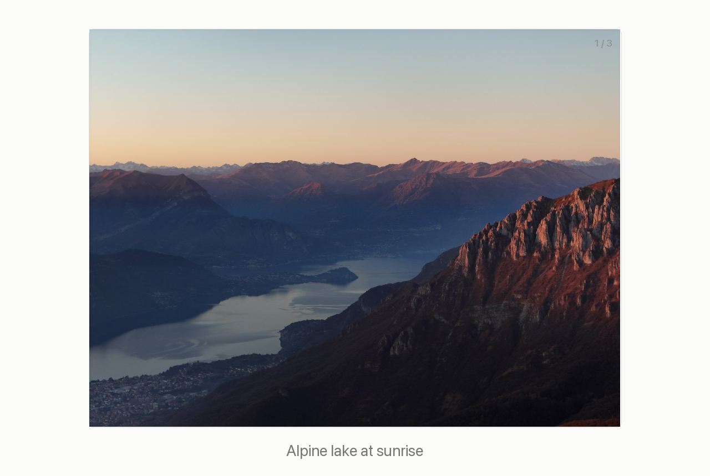

# Simple Image Slider

Simple Image Slider is a lightweight Obsidian plugin that renders a group of image embeds as a clean swipeable slider with captions. It can also show captions for ordinary image embeds.

It is intentionally small. It supports Obsidian image wikilinks, click navigation, keyboard navigation, swipe/drag navigation, and captions. It does not include thumbnails, fullscreen mode, autoplay, video/audio/PDF support, annotations, compression, compare mode, or a settings panel.



## Features

- Render multiple Obsidian image embeds as one slider.
- Swipe or drag horizontally to move between images.
- Use left/right keyboard navigation when the slider has focus.
- Keep captions below images so they do not cover image content.
- Hide visual controls by default for a quiet article-style layout.
- Add visible captions to ordinary captioned images without modifying note content.
- Insert a starter slider block from the command palette, then bind it to a hotkey if desired.

## Usage

Add an `image-slider` code block to a note:

````markdown
```image-slider
![[landscape-lake.jpg|Alpine lake at sunrise]]
![[forest-river.jpg|River through evergreen forest]]
![[red-rock-desert.jpg|Red rock desert trail]]
```
````

Supported slider line forms:

```markdown
![[image.png]]
![[image.png|caption]]
![[folder/image.png|caption]]
![[folder/image.png | caption]]
```

The text after `|` is displayed as a caption under the image. If a slide has no caption, no caption is shown.

You can also run `Simple Image Slider: Insert image slider block` from the command palette. To make it faster, bind that command in Obsidian's Hotkeys settings.

Ordinary image captions are also supported:

```markdown
![[image.png|caption]]

```

For ordinary images, `|300` and `|300x200` are treated as Obsidian size aliases, not captions.

## Behavior

- One image is shown at a time.
- Previous and next controls wrap around at the ends.
- Horizontal swipe or drag changes slides.
- The current image is preserved when the same slider block re-renders after editing.
- Small accidental drag movement is ignored.
- The image uses `object-fit: contain`.
- The image area uses a stable 4:3 canvas and prioritizes filling the available width.
- Hover effects do not resize, crop, scale, shift, or reflow the image area.
- Missing or unsupported lines are skipped; valid images still render.
- If no valid images are found, the block renders `No valid images found.`
- Ordinary image captions are added during rendering and do not modify note content.

## Install Manually

1. Build the plugin:

```bash
npm install
npm run build
```

2. Copy these files into your vault:

```text
<vault>/.obsidian/plugins/simple-image-slider/
  main.js
  manifest.json
  styles.css
```

3. Enable `Simple Image Slider` in Obsidian community plugins.

## Development

```bash
npm install
npm run verify
```

`npm run verify` runs parser/CSS tests and then builds the Obsidian plugin.

## Documentation

- [Acceptance tests](docs/specs/goal-and-acceptance-tests.md)
- [Requirements spec](docs/specs/simple-image-slider-requirements.md)

## Demo Image Credits

The README demo uses landscape photos from Unsplash:

- [Lake photo](https://unsplash.com/photos/mountain-landscape-with-a-lake-at-sunrise-agaatGoOIlQ) by Cosmin Andrei Buzamat
- [Forest river photo](https://unsplash.com/photos/fast-flowing-river-through-a-rocky-forest-landscape-sdWitIvtP0g) by Dennis Zhang
- [Desert photo](https://unsplash.com/photos/desert-landscape-with-red-rock-formations-and-sparse-vegetation-SoLWkVvF7cU) by Dan Begel

## License

MIT
